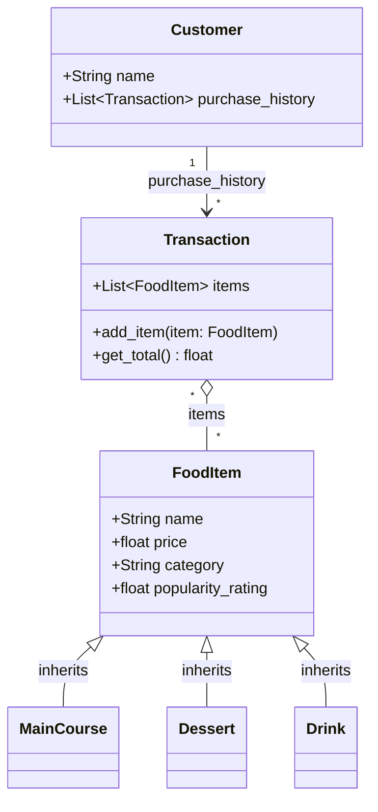

# ByteBites Class Diagram

```mermaid
classDiagram
    class Customer {
        +String name
        +List~Transaction~ purchase_history
    }

    class FoodItem {
        +String name
        +float price
        +String category
        +float popularity_rating
    }

    class MainCourse {
    }

    class Dessert {
    }

    class Drink {
    }

    class Transaction {
        +List~FoodItem~ items
        +add_item(item: FoodItem)
        +get_total() float
    }

    FoodItem <|-- MainCourse : inherits
    FoodItem <|-- Dessert : inherits
    FoodItem <|-- Drink : inherits

    Customer "1" --> "*" Transaction : purchase_history
    Transaction "*" o-- "*" FoodItem : items
```
